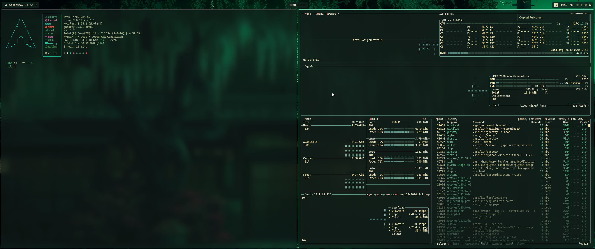

# Dotfiles for Hyprland on Arch Linux

[](https://archlinux.org/)

Dotfiles setup with static and plenty of useful scripts.



Quick info:

- [bin](bin) - all scripts live here, it is added to path in uwsm config
- [install](install/install) - main installation script
- [pkgs.txt](install/pkgs.txt) - packages to be installed
- [setup-applications](install/setup-applications) - hides some annoying applications from launcher
- [setup-by-hardware](install/setup-by-hardware) - sets up monitors, keybindings, hypr enviroments
- [setup-config](install/setup-config) - copies full config into ~/.config
- [setup-mvim](install/setup-mvim) - mvim setup
- [setup-nvidia](install/setup-nvidia) - nvidia specific setup
- [setup-system](install/setup-system) - ufw, pacman.conf, triggers nvidia-setup if on nvidia gpu, git, sddm login manager (if exists), enables gcr agent for ssh, disables systemd-networkd-wait-online.service that causes extremly long boot time
- [setup-theme](install/setup-theme) - theming setup and symlinks
- [setup-zsh](install/setup-zsh) - full zsh config with oh-my-zsh, plugins, nice features

## Table of Contents

- [Features](#features)
- [Installation](#installation)
  - [Automatic installer](#automatic-installer)
  - [Manual installation](#manual-installation)
- [Keybinds](#keybinds)
- [Credits](#credits)

---

## Features

- **Static Theming System** - Switch between static themes 
- **Utility Scripts** - Interactive package management; theming; setup of Postgres & database backup and restoration, Docker, Node.js; video download (with yt-dlp), video and image transcoding (using handbrakecli and imagemagick), interactive backups with fzf
- **Modular ZSH Config** - Zsh setup with some nice custom functions like `cp2c` (copy file content to clipboard - c2pc <file_path>) and `c2f` (clipboard content to file c2f <file_path>)
- **Application Configs** - Configs for Ghostty, Waybar, Walker, Elephant, Mvim and more

---

## Installation

### Automatic installer

```bash
curl -fsSL https://raw.githubusercontent.com/Phuocminh94/archdots/master/setup.sh | bash
```

**⚠️ Important Notes:**

- This is specifically for **Arch Linux with Hyprland**
- I've tested the installer on both fresh installs and configured desktops, but ideally you should **know what you're doing**, make sure to backup manually just in case
- Everything that will be changed is backed up first

**What the installer does:**

<details>
<summary><b>Backup</b></summary>

- Backs up everything that will be changed ([backup script](install/lib/backup.sh))
  - Files in `~/.config`
  - `pacman.conf`
  - Sddm display manager configuration (if installed)
  - Zsh and Mvim configs
  - Everything else that gets modified
- Creates a backup folder in your Home directory with:
  - A text file listing all changed files
  - Commands to quickly revert everything
  - A [rollback script](install/lib/rollback.sh) for easy restoration

</details>

<details>
<summary><b>Package Installation</b></summary>

- Installs [packages](install/pkgs.txt) from official repos and AUR

</details>

<details>
<summary><b>Hardware Detection</b></summary>

The installer [detects your hardware](install/setup-by-hardware):

- **Laptop/Desktop** - Uses brightnessctl or ddcutil respectively, applies proper Hyprland keybinding profiles
- **Monitor Configuration** - Checks your monitor's highest resolution and refresh rate with `hyprctl monitors` and creates appropriate `monitors.conf`
- **Nvidia GPUs** - Detects Nvidia cards and applies [Nvidia-specific setup](install/setup-nvidia) with proper Hyprland env configs

</details>

<details>
<summary><b>Configuration & Theming</b></summary>

- Replaces configuration files in `~/.config` with the [config](config) directory contents
- Sets up static via [theme setup](install/setup-theme)
- Configures symlinks for theme management
- Some files live in the [default](default) directory - these are git synced and will get overwritten with updates

</details>

<details>
<summary><b>Scripts</b></summary>

A big collection of scripts, mainly used with Walker & Elephant. If installing manually make sure to add the scripts folder to path:

- **Theme Management** - Switch themes, cycle backgrounds, apply dynamic theming
- **Development** - PostgreSQL setup/backup/restore, Docker setup, Node.js setup
- **Package Management** - Install/remove packages interactively
- **Media Tools** - Video downloads (yt-dlp), transcoding (ffmpeg, handbrake-cli)
- **System Utils** - Backup/restore files, keybinds, screenshots menu and video recording
- Most scripts are accessible interactively through Walker or Elephant

</details>

<details>
<summary><b>System Configuration</b></summary>

- [System setup](install/setup-system) configures:
  - Git configuration
  - Ly display manager (if installed)
  - Pacman configuration
  - UFW firewall
- Full [ZSH setup](default/zshrc) with modular configuration

</details>

### Manual installation

You can manually use the dotfiles without the installer:

1. Clone the repository
2. Copy desired configs from `config/` to `~/.config/` (some configs live in [default](default) directory. Also everything relies on the scripts folder being in path)
3. Copy scripts from `bin/` to your preferred location
4. You can use some install scripts for partial setup if you want

---

## Keybinds

Just press SUPER + ALT + Space -> keybindings - all bindings nicely sorted here

Most important ones:

- SUPER + T = Open Terminal
- SUPER + Q = Close window
- SUPER + R = Open Walker
- SUPER + E = File manager
- SUPER + SHIFT + V = Clipboard
- SUPER + ALT + Space = Menu

---

## Theming & Customization

### Changing Themes

The setup includes both static and dynamic theming:

- Open walker and select a theme you like, you can pick between static ones
- Also, you can pick 3 different waybar themes and 2 fastfetch presets

### Customizing Configs

- You can modify everything in [config](config) easily, it is not git synced and will not get overwritten
- Configs in [default](default) are git synced and will get overwritten with updates

---

## Credits

- <https://github.com/mkbula/dotfiles>
